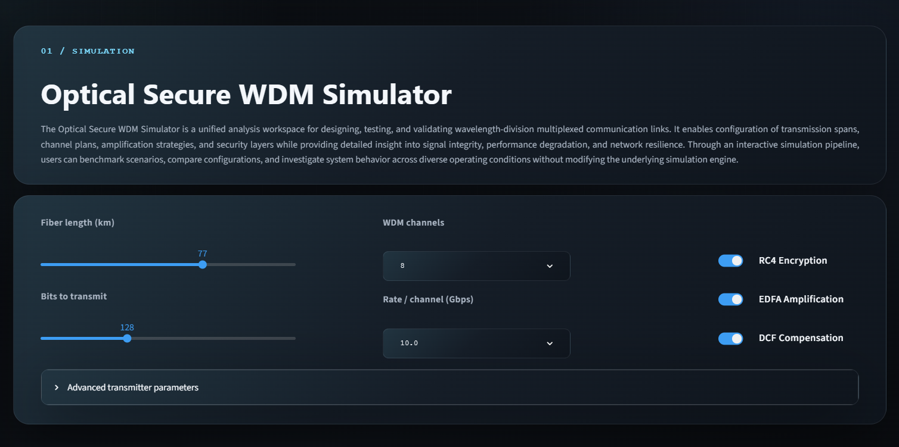
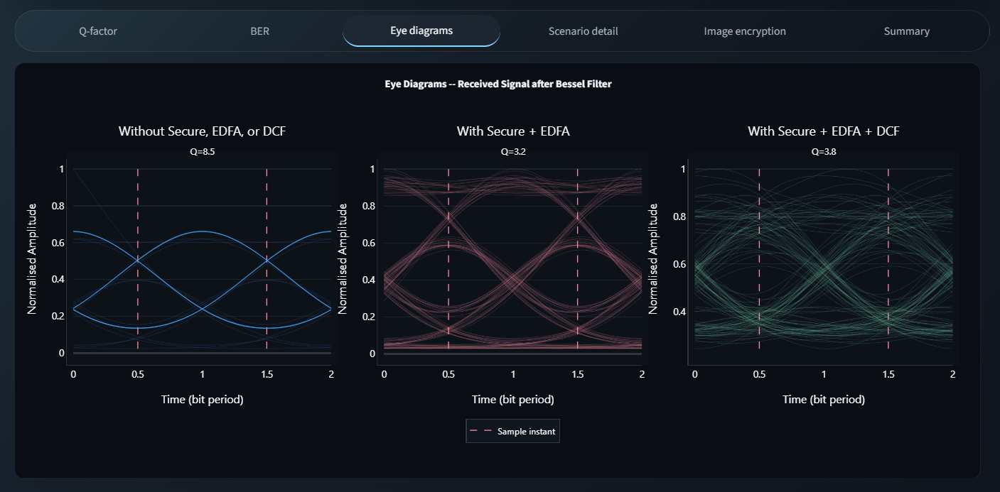
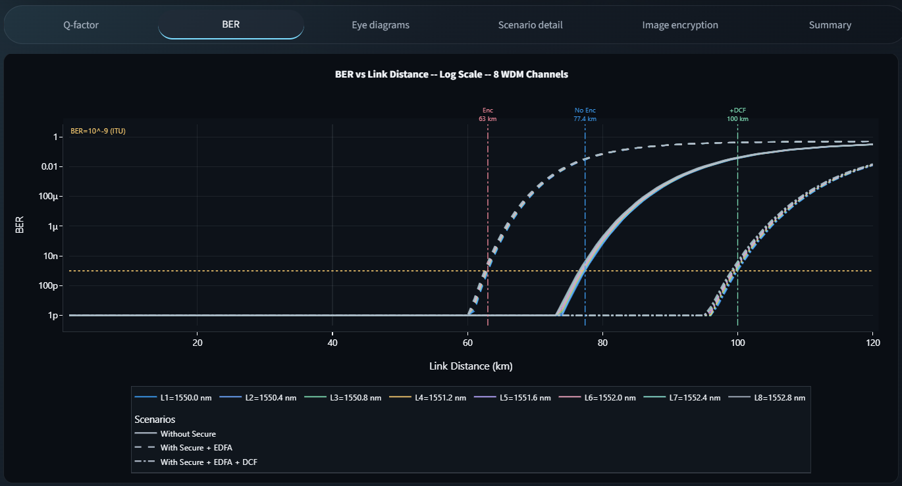
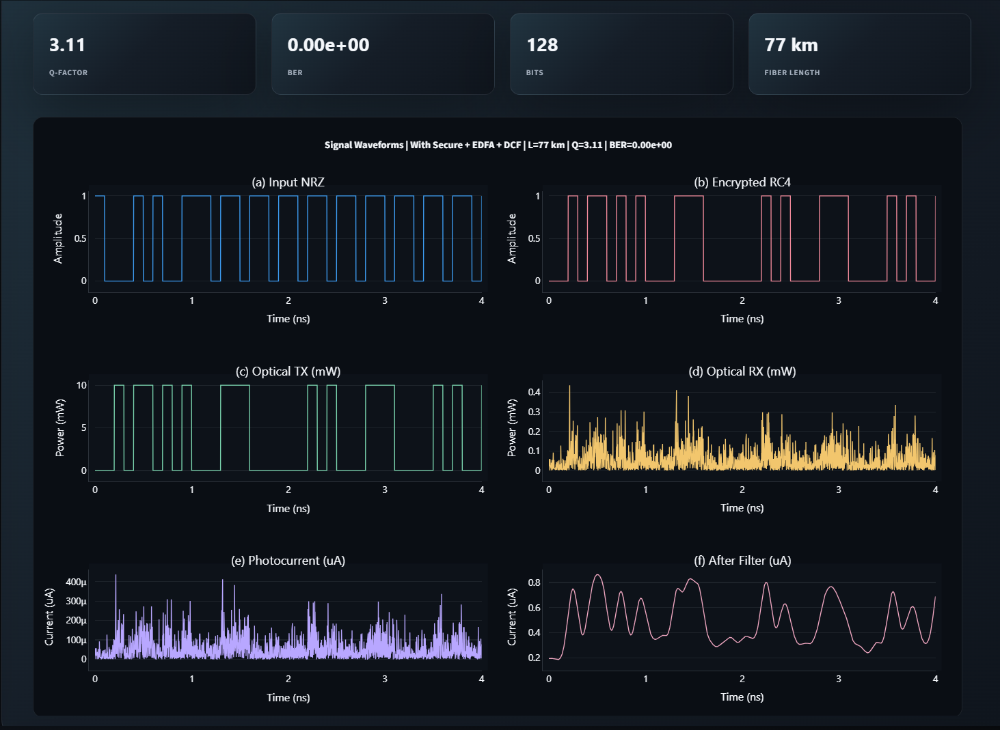

# Optical Secure WDM Simulator

A Python simulation framework for designing, testing, and validating wavelength-division multiplexed (WDM) optical communication links — with built-in RC4 encryption, EDFA amplification, and DCF dispersion compensation.

🔗 **Live Demo:** [secure-wdm-simulator.onrender.com](https://secure-wdm-simulator.onrender.com)

---

## What It Does

This simulator lets you model an end-to-end WDM optical link and study how signal integrity degrades over distance. You can configure the fiber length, number of wavelength channels, data rate, and toggle security/amplification layers — then compare results across multiple scenarios through an interactive dashboard.

Key simulation features:

- NRZ signal generation and RC4-based stream encryption
- Optical transmission across configurable fiber spans
- EDFA (Erbium-Doped Fiber Amplifier) noise modeling
- DCF (Dispersion Compensating Fiber) correction
- Bessel-filtered receiver and photodetector modeling
- Q-factor, BER, eye diagrams, and waveform analysis
- Image encryption visualization as a practical security demo

---

## Python Skills

This project demonstrates applied Python across several engineering domains:

**Numerical Computing — `numpy`**
All signal arrays, bit sequences, noise injection, and physical channel math (attenuation, dispersion) are built on NumPy vectorised operations, avoiding loops for performance.

**Signal Processing — `scipy`**
SciPy's `signal` module powers the Bessel low-pass filter applied at the receiver. Statistical functions compute Q-factor from the sampled eye distribution.

**Data Analysis — `pandas`**
Scenario comparison tables and summary metrics are structured with Pandas DataFrames for clean display and easy export.

**Interactive Visualisation — `plotly`**
BER-vs-distance curves on a log scale, eye diagrams with overlaid traces, and multi-channel WDM spectrum plots are rendered with Plotly for interactivity inside the browser.

**Static Plotting — `matplotlib`**
Waveform subplots (Input NRZ, Encrypted RC4, Optical TX/RX, Photocurrent, After Filter) are generated with Matplotlib and embedded directly into the Streamlit UI.

**Image Processing — `Pillow`**
The image encryption tab uses Pillow to apply RC4-based pixel scrambling and demonstrate visual cipher effects on bitmap data.

**Web Application — `streamlit`**
The entire interactive dashboard — sliders, dropdowns, toggles, multi-tab results, and live metric cards — is built purely in Python with Streamlit, with no JavaScript required.

**Modular Architecture**
The codebase is organised into domain-specific Python packages, each with a clear responsibility:

```
WDM-simulation/
├── signal_generation/   # NRZ bit stream generation
├── modulation/          # Optical modulator (NRZ → optical power)
├── encryption/          # RC4 stream cipher implementation
├── fiber_channel/       # Attenuation, dispersion, noise (ASE)
├── receiver/            # Photodetector, Bessel filter, BER/Q calculation
├── analysis/            # Eye diagram construction, scenario comparison
├── simulation/          # Pipeline orchestrator tying all modules together
├── ui/                  # Streamlit page components and layout
├── config.py            # Centralised simulation constants
└── main.py              # Entry point
```

---

## Getting Started

```bash
git clone https://github.com/parinith-web/WDM-simulation.git
cd WDM-simulation
pip install -r requirements.txt
streamlit run main.py
```

Then open `http://localhost:8501` in your browser.

---

## Dependencies

| Library | Version | Role |
|---|---|---|
| `numpy` | ≥ 1.24 | Numerical arrays and signal math |
| `scipy` | ≥ 1.10 | Bessel filter and statistics |
| `matplotlib` | ≥ 3.7 | Waveform subplot rendering |
| `streamlit` | ≥ 1.55 | Interactive web dashboard |
| `plotly` | ≥ 5.17 | BER curves and eye diagrams |
| `pandas` | ≥ 2.0 | Scenario tables and metrics |
| `Pillow` | ≥ 10.0 | Image encryption visualisation |

---

## Screenshots

| Simulation Controls | Signal Waveforms |
|:---:|:---:|
|  |  |
| Fiber length, WDM channels, encryption and amplification toggles | Input NRZ → Encrypted → Optical TX/RX → Filtered |

| Eye Diagrams | BER vs Distance |
|:---:|:---:|
|  |  |
| Three scenarios compared side-by-side (Q=8.5 / 3.2 / 3.8) | Log-scale BER for all 8 WDM channels across 120 km |

---

## License

MIT
